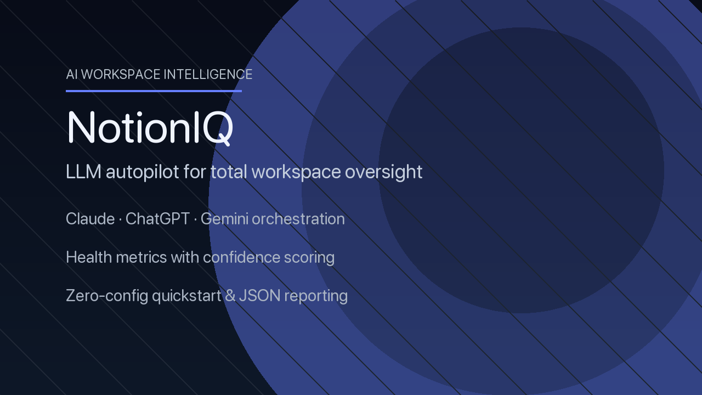
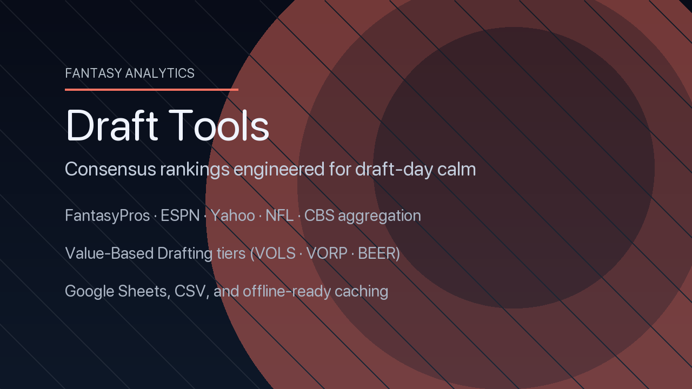
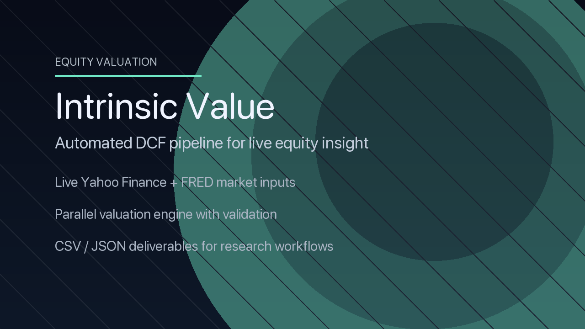

  &nbsp;
  &nbsp;
  

<h1 align="center">Brandon Shay — AI Engineer</h1>

  I build AI copilots, intelligent analytics, and automation that ship. 
  Pragmatic systems, clean interfaces, measurable outcomes.

  <em>Recent work:</em> LLM workspace audits • consensus draft analytics • live‑market valuation pipelines

---

**What I Do**
- AI copilots that take action (multi‑provider, safe fallbacks, observability)
- Decision‑support analytics (aggregation, ranking, reporting, exports)
- Production ML/MLOps (containers, CI, metrics, reproducible pipelines)

---

**Selected Work**

<a href="https://github.com/ShadyBad/notionIQ"><h3>NotionIQ — LLM Workspace Auditor</h3></a>
<picture>
  <source srcset="assets/notioniq-demo.gif" type="image/gif">
  
</picture>

- Problem → Fragmented pages, inbox bloat, duplicative databases slow teams.
- Approach → Multi‑provider LLM orchestration (Claude/GPT/Gemini), deep health metrics, JSON reports.
- Impact → Actionable playbooks; cached runs cut API spend significantly.
- Docs → See case study below.

<a href="https://github.com/ShadyBad/ff_draft_tools"><h3>Fantasy Draft Tools — Consensus + VBD Engine</h3></a>
<picture>
  <source srcset="assets/ff-draft-tools-demo.gif" type="image/gif">
  
</picture>

- Problem → Fragmented rankings and noisy advice; hard cross‑positional calls.
- Approach → Aggregates 5+ sources, VBD (VOLS/VORP/BEER), presets, offline caching.
- Impact → Calm draft day with reproducible boards + Sheets/CSV exports.
- Docs → See case study below.

<a href="https://github.com/ShadyBad/intrinsic-value-calculator"><h3>Intrinsic Value Calculator — Live DCF at Scale</h3></a>
<picture>
  <source srcset="assets/intrinsic-value-demo.gif" type="image/gif">
  
</picture>

- Problem → Ad‑hoc valuations lack consistency and auditability.
- Approach → Live data (Yahoo, FRED), parallelized DCF, risk/growth adjustments.
- Impact → Investor‑ready CSV/JSON outputs for dashboards and research.
- Docs → See case study below.

---

**Operating Principles**
- Speed with safety: fast loops, strong guards, reversible changes.
- Observability first: logs, metrics, JSON artifacts; decisions are inspectable.
- Simplicity scales: clear boundaries, predictable deployments.
- User empathy: defaults that work, frictionless installs, readable reports.

---

**Writing & Resources**
- Academy Orientation — docs/academy/orientation.md
- Command‑Line Toolkit — docs/playbooks/command-line-toolkit.md
- IDE & Environment Verification — docs/playbooks/ide-setup.md
- Mathematics for AI — docs/foundations/math-for-ai.md
- Python Essentials — docs/foundations/python-essentials.md

  
<strong>Toolbox</strong> (click to expand)

AI & Data: PyTorch • scikit‑learn • Hugging Face • pandas • NumPy • Polars  
Platforms: Python • PowerShell • Bash • FastAPI • Streamlit • Docker • AWS  
Dev Flow: Git • GitHub Actions • pytest • Make • VS Code

  
<strong>GitHub Signals</strong> (click to expand)

  

    
    
  

---

**Let’s Build**
- Email: bpshay13@gmail.com
- LinkedIn: linkedin.com/in/brandonpshay/
- Open to full‑time roles and selective consulting.

---

<h3 id="case-studies">Case Studies</h3>
- NotionIQ — docs/case-studies/notioniq.md
- Fantasy Draft Tools — docs/case-studies/ff-draft-tools.md
- Intrinsic Value Calculator — docs/case-studies/intrinsic-value.md
