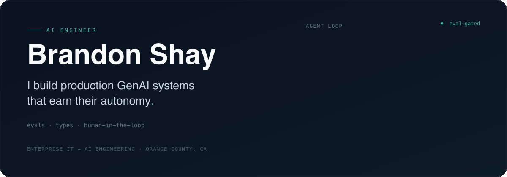
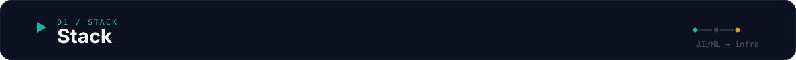
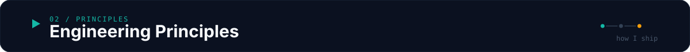

  

  
  
  

  Enterprise IT Systems Engineer (GCP, Workato, Workspace) transitioning full-time into AI engineering. I ship typed Python, instrumented pipelines, and agents that earn their autonomy.

 

**Core AI/ML**

**Backend**

-261230?style=flat-square)

**Infra & Ops**

 

**Eval-first.** Every GenAI project ships with an eval harness before it ships a feature. If you can't measure it, you can't trust it in production.

**Typed, modular Python.** `mypy --strict`, Ruff, no notebooks in main, no untyped public APIs. Code that's read more than it's run.

**Human-in-the-loop on irreversible actions.** Models propose; engineers commit. Reversible architecture by default. Every action has an undo path.

**Observable by construction.** Langfuse traces, structured logs, cost + latency budgets. Debugging a production agent at 2am should not require new instrumentation.
