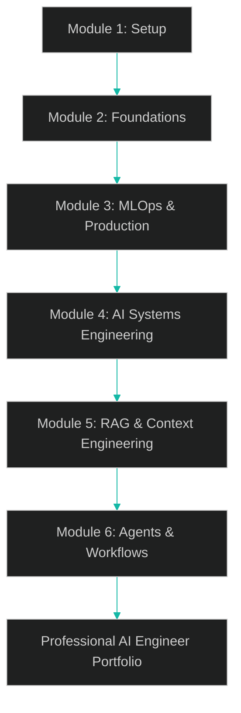

# MLExpert Academy Orientation Notes

## Executive Summary

MLExpert Academy is a hands-on, career-focused training program that transforms learners into professional AI engineers. The curriculum follows a progressive, project-based structure mirroring real-world workflows at top AI companies. Students progress from foundational technical setup to advanced AI system design, culminating in autonomous AI agent creation.

The program emphasizes practical skill-building, production-readiness, and portfolio development, ensuring graduates can confidently design, deploy, and maintain AI systems at scale.

## Key Concepts

### Academy Goals

- Train professional AI engineers, not just ML researchers or hobbyists
- Focus on hands-on experience with real-world tools
- Build a portfolio demonstrating production-grade AI engineering capability

### Learning Outcomes

By completion, students will:

- Master the AI engineering toolkit, from dev setup to deployment
- Build multiple end-to-end AI projects (chatbots, RAG systems, ML pipelines)
- Gain experience with production tools like Docker, Git, cloud services, and vector databases
- Develop the confidence and workflow habits of professional AI engineers

## Module Overview

| Module | Focus | Core Topics / Skills | Outcome / Project |
| --- | --- | --- | --- |
| 1. The AI Engineer's Setup | Development environment setup | Git, Docker, Python environments, IDEs, CLI tools | Fully configured AI engineering workstation |
| 2. AI/ML Foundations | Core programming and ML theory | Python for AI, math foundations, PyTorch, linear models | ML fundamentals through small applied models |
| 3. MLOps and Production Systems | Model deployment and scalability | Data pipelines, experiment tracking, containerization, cloud deployment | End-to-end deployable ML pipeline |
| 4. AI Systems Engineering | Application-level AI systems | Prompt engineering, API integration, structured outputs, LLM evaluation | Production-ready LLM-powered app |
| 5. RAG and Context Engineering | Connecting LLMs to external knowledge | Vector databases, retrieval systems, document processing, memory architectures | Context-aware retrieval-augmented AI system |
| 6. Agents and Workflows | Autonomous AI systems | Agent architectures, planning, multi-agent systems, tool usage | Fully functional AI agent system |

## Program Principles

### Hands-On from Day One

- Every lesson includes active implementation tasks
- Learners build usable, real-world systems—not theoretical exercises

### Professional Tooling

- Technologies align with those used at OpenAI, Anthropic, Google, and other industry leaders
- Students learn industry workflows (e.g., Git branching, Dockerized deployments, reproducible environments)

### Progressive Complexity

- Each module builds on prior knowledge for smooth cognitive load progression
- Learning mirrors real AI engineering pipelines—from setup → development → deployment → systems → agents

### Real Projects

- Every module ends with a portfolio-worthy deliverable
- Projects emphasize problem-solving, reliability, and scalability

### Production Readiness

- Emphasis on deployment, monitoring, and maintenance, not just model training
- Learners graduate ready for AI engineer roles across startups and enterprise environments

## Learning Flow (Process Diagram)

## Key Quotes

> You're not just here to learn theory—you're here to build real skills with real tools that you'll use every day as a professional.

> Most ML projects fail because they never make it to production—but you'll learn to ship models, not just build them.

> Taking the time to set up your development environment properly will pay dividends throughout your entire journey.

## Study Plan

1. Set Up the Professional Toolkit
   - Install and configure Git, Docker, and Python environments
   - Set up your IDE with proper extensions and workflow integrations
2. Build AI Foundations
   - Practice Python for ML and AI
   - Review linear algebra, calculus, and statistics essentials
   - Implement models in PyTorch
3. Learn Production Engineering (MLOps)
   - Create reproducible pipelines and containerized environments
   - Use experiment tracking and cloud deployment
4. Develop LLM Applications
   - Explore prompt engineering and structured outputs
   - Build end-to-end LLM-powered applications
5. Implement RAG Systems
   - Integrate vector databases and retrieval workflows
   - Engineer memory systems for dynamic knowledge access
6. Build AI Agents
   - Construct autonomous, multi-step reasoning agents
   - Design workflows with planning and tool-use capabilities

## Open Questions

- Will the academy include specific tech stack recommendations (e.g., preferred cloud providers or vector databases)?
- Are capstone projects peer-reviewed or instructor-reviewed?
- Will learners receive certification or career support upon completion?

