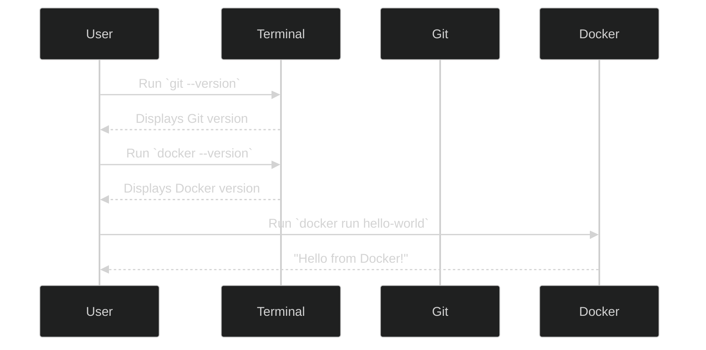

# The Command-Line Toolkit — MLExpert Academy

## Executive Summary

This tutorial introduces the essential command-line tools that form the backbone of every AI engineer’s workflow: Git for version control and Docker for reproducible environments. These tools establish the foundation for all subsequent tutorials, ensuring that every AI project you build is organized, shareable, and deployable.

By the end of this tutorial, you will:

- Understand why Git and Docker are non-negotiable tools for AI engineers
- Successfully install and verify both tools on your system
- Gain confidence using the command line to manage and isolate your development environments

## Key Concepts

### Why a Command-Line Toolkit Matters

AI engineering requires stability, reproducibility, and collaboration. The command-line toolkit provides these by standardizing how code and environments are managed.

Without these tools, engineers often face:

- Lost work due to untracked changes
- “It works on my machine” deployment failures
- Inconsistent environments that break code on different systems

Setting up this toolkit ensures a professional-grade workflow from day one.

## Core Tools

### 1. Git — Version Control & Collaboration

Purpose: Tracks every change made to your code, enabling collaboration and safe experimentation.

Key Benefits:

- Complete project history and easy rollback
- Branching and merging for team workflows
- Confidence to experiment without breaking main code

Verification Command:

```bash
git --version
```

Expected Output:

```
git version 2.50.1
```

Troubleshooting Tip: If you see `command not found: git`, restart your terminal or reinstall Git.

### 2. Docker — Reproducible Environments

Purpose: Encapsulates your project and dependencies into containers that run identically on any machine.

Key Benefits:

- Eliminates “works on my machine” issues
- Enables consistent deployment across systems
- Forms the foundation for cloud deployment workflows

Verification Commands:

```bash
docker --version
```

Expected output:

```
Docker version 28.3.2, build 578ccf6
```

Test the installation:

```bash
docker run hello-world
```

Expected Output:

```
Hello from Docker!
This message shows that your installation appears to be working correctly.
```

Troubleshooting Tip: If you see `Cannot connect to the Docker daemon`, ensure Docker Desktop is running and initialized.

## Installation Steps

| Step | Tool | macOS | Windows | Linux |
| --- | --- | --- | --- | --- |
| 1 | Git | `xcode-select --install` | Install via Git for Windows | `sudo apt install git` |
| 2 | Docker Desktop | `brew install --cask docker-desktop` | Install from Docker Desktop site | Follow Docker Engine guide |

## Verification Workflow



## Reference Resources

### Git Learning Resources

- Atlassian’s “Learn Git” Tutorial
- Learn Git Branching (Interactive)
- GitHub Git Cheatsheet

### Docker Learning Resources

- Docker’s Official “Get Started” Guide
- Play with Docker (Interactive Lab)

## Examples

### Example: Verifying Git

```bash
git init
git add .
git commit -m "Initial commit"
```

### Example: Running a Simple Docker Container

```bash
docker run ubuntu echo "Hello AI Engineer"
```

## Pitfalls

| Issue | Cause | Fix |
| --- | --- | --- |
| `command not found: git` | Terminal not restarted or Git not installed | Restart terminal or reinstall Git |
| `Cannot connect to Docker daemon` | Docker Desktop not running | Start Docker Desktop and retry |
| `Permission denied` (Linux) | User not in Docker group | Add user to Docker group: `sudo usermod -aG docker $USER` |

