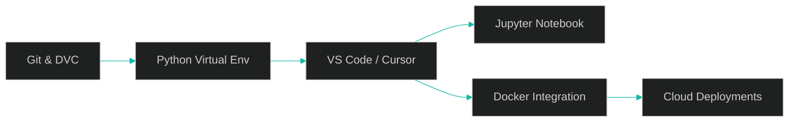

# IDE and Environment Verification — MLExpert Academy

## Executive Summary

This tutorial completes your AI engineering environment setup by connecting all tools—Git, Docker, Python, DVC, and your IDE—into a cohesive, professional-grade development workspace. You'll configure Visual Studio Code (VS Code) or Cursor with essential extensions, link your virtual environment, and run an end-to-end verification of your AI toolchain.

By the end, your IDE will serve as a unified hub for coding, debugging, container management, version control, and experimentation—ready for real-world AI engineering.

## Key Concepts

### Why IDE Configuration Matters

Installing Git, Docker, and Python isn't enough. Productivity and reliability come from integration. A properly configured IDE gives you:

- Error detection and auto-formatting as you type
- Integrated access to Docker containers, virtual environments, and Jupyter notebooks
- Seamless command-line integration for DVC, Git, and ML workflows
- A single workspace that feels "just right" for daily engineering

### IDE Options

| IDE | Highlights | Best For |
| --- | --- | --- |
| VS Code | Free, widely used, feature-rich; supports GitHub Copilot | Classic setup with rich ecosystem |
| Cursor | Built on VS Code, but AI-enhanced (contextual code generation and refactoring) | Developers who want integrated AI assistance |

Both integrate perfectly with your setup.

## Tutorial Goals

- Configure VS Code or Cursor for AI engineering
- Install essential productivity and quality extensions
- Connect the IDE to your virtual environment and Docker
- Verify the complete workflow (data → code → notebook)

## Essential Extensions

| Extension | Publisher | Purpose / Benefit |
| --- | --- | --- |
| Python | Microsoft | Intelligent completion, debugging, environment management |
| Jupyter | Microsoft | Run notebooks directly in IDE |
| Docker | Microsoft | Manage containers visually |
| Ruff | Astral Software | Fast linting, formatting, and import organization |

## IDE Configuration

Create a project-level configuration to enforce consistent Python and notebook formatting.

Create `.vscode/settings.json`:

```json
{
  "[python]": {
    "editor.formatOnSave": true,
    "editor.defaultFormatter": "charliermarsh.ruff",
    "editor.codeActionsOnSave": {
      "source.fixAll": "explicit",
      "source.organizeImports": "explicit"
    }
  },
  "notebook.formatOnSave.enabled": true,
  "notebook.codeActionsOnSave": {
    "notebook.source.fixAll": "explicit",
    "notebook.source.organizeImports": "explicit"
  }
}
```

## Selecting the Python Interpreter

Open Command Palette → Python: Select Interpreter → Choose the `.venv` path.

If successful, your IDE's status bar will show your virtual environment name.

## Comprehensive System Verification

### Step 1: Create and Version a Dataset

Create `data/supercars.csv` and track it with DVC and Git:

```bash
dvc add data
git add data.dvc .gitignore
git commit -m "feat: Add initial supercar dataset"
```

### Step 2: Run a Python Script

Create `main.py`:

```python
import pandas as pd
from pathlib import Path

def main():
    data_path = Path("data") / "supercars.csv"
    print(f"--- Loading data from {data_path} ---")
    df = pd.read_csv(data_path)
    print("--- Dataset Head ---")
    print(df.head())

if __name__ == "__main__":
    main()
```

Run inside the IDE using "Run Python File in Terminal".

### Step 3: Verify Jupyter Environment

Create `analysis.ipynb` and run:

```python
import pandas as pd
from pathlib import Path

data_path = Path("data") / "supercars.csv"
df = pd.read_csv(data_path)
df
```

If the table displays correctly, the Jupyter extension is fully connected to your environment.

## System Integration Flow



## Pitfalls

| Issue | Likely Cause | Fix |
| --- | --- | --- |
| Python environment not detected | IDE not linked to `.venv` | Use "Python: Select Interpreter" |
| Ruff not formatting on save | Missing formatter configuration | Check `.vscode/settings.json` |
| Jupyter kernel mismatch | Wrong interpreter selected | Switch notebook kernel to `.venv` |
| Docker not visible in IDE | Docker Desktop not running | Start Docker before launching IDE |

